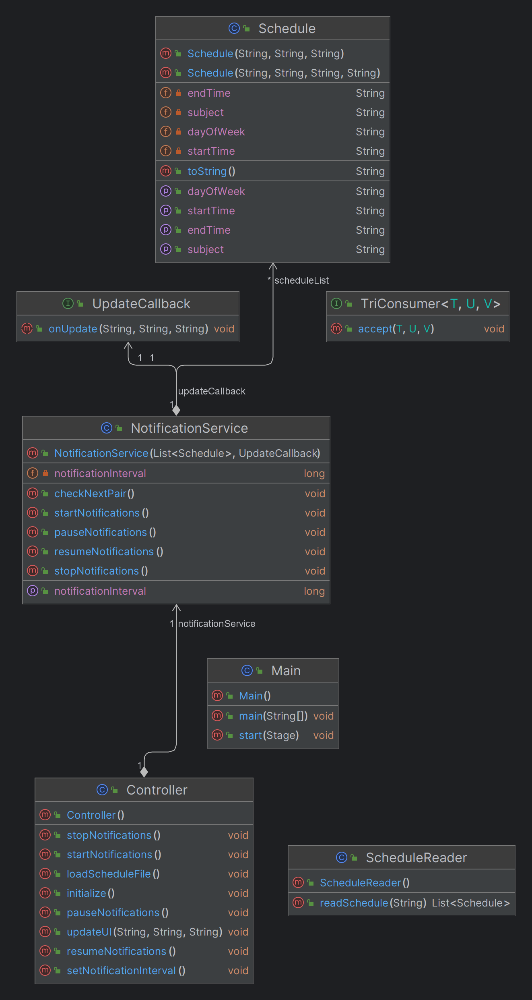

# Технология программирования
Технология программирования - технология разработки программного средства, включающая все процессы, начиная с момента зарождения идеи этого средства. Результатом применения технологий программирования является программа, действующая в заданной вычислительной среде, хорошо отлаженная и документированная, доступная для понимания и развития в процессе сопровождения.

> [!IMPORTANT]
> Лабораторные работы по дисциплине __"Технология программирования"__
> > бОИС-221 Сенцов Д.С.
- [x] Самостоятельная работа
- ["Сколько до пары" (Task 1)](https://github.com/gedjien/bois221_javafx_sn/tree/prTask_NowLesson)
- ["Погоня за фигурами" (Task 2)](https://github.com/gedjien/bois221_javafx_sn/tree/prTask_%D0%A1hase-for-figures)
- ["Таймер времени" (Task 3)](https://github.com/gedjien/bois221_javafx_sn/tree/prTask_TimerServer)

# "Сколько до пары"

Программа предназначена для оповещения студентов о времени начала/окончания следующей пары, с учетом текущего времени и расписания занятий.

## Функуиональные требования

**Чтение расписания:** Программа должна считывать расписание занятий из файла в формате, который можно легко обработать. 
 
**Определение текущего времени:** Программа должна использовать Java LocalDateTime для получения точного текущего времени.
 
**Сравнение времени:** Программа должна сравнивать текущее время с временем начала и окончания каждой пары, чтобы определить, какая пара ближе: текущая или следующая.
 
**Вывод оповещения:** Программа должна выводить оповещение, указывающее:
     Название предмета следующей пары.
     Время начала/окончания этой пары.
     Сколько времени осталось до начала/окончания этой пары.
 
**Управление оповещениями:**
     Программа должна предоставлять возможность настройки частоты оповещений (например, каждые 5 минут).
     Программа должна иметь возможность отключения оповещений на определенное время (например, на время обеда).

## Архитектура приложения

Структура программы включает модули:

- Адаптер для чтения расписания из текстового файла (например, CSV или JSON).

- Интерфейс пользователя: Консольный интерфейс или графический интерфейс (GUI).

## Реализация

Main.java точка входа в приложение

NotificationService.java отвечает за логику уведомлений
использует Timer и TimerTask для периодической проверки расписания и определения следующей пары
checkNextPair вычисляет, сколько времени осталось до начала следующей пары или до её окончания, если пара уже идет
через метод setNotificationInterval можно настроить интервал уведомлений
Уведомления могут быть запущены, остановлены, приостановлены и возобновлены с помощью соответствующих методов.

Schedule.java представляет собой модель данных для расписания, содержит информацию о предмете, времени начала и окончания пары, а также дне недели

ScheduleReader.java отвечает за чтение расписания из CSV-файла
использует BufferedReader для чтения файла и преобразует каждую строку в объект Schedule
Файл должен быть в формате CSV с разделителем ;.

TriConsumer.java функциональный интерфейс, который принимает три аргумента, используется для передачи методов, которые принимают три параметра

UpdateCallback.java интерфейс обратного вызова, который используется для обновления пользовательского интерфейса

Основная логика работы приложения:
1. Пользователь загружает CSV-файл с расписанием через интерфейс.
2. Приложение считывает файл и создает список объектов Schedule.
3. Пользователь может установить интервал уведомлений и запустить уведомления.
4. Приложение периодически проверяет текущее время и сравнивает его с расписанием, чтобы определить, сколько времени осталось до следующей пары.
5. Если пара найдена, приложение обновляет интерфейс, отображая информацию о следующей паре и оставшемся времени.
6. Пользователь может приостановить или остановить уведомления, а также возобновить их.

Используемые паттерны:
Фабричный метод, Наблюдатель

## Диаграмма классов

