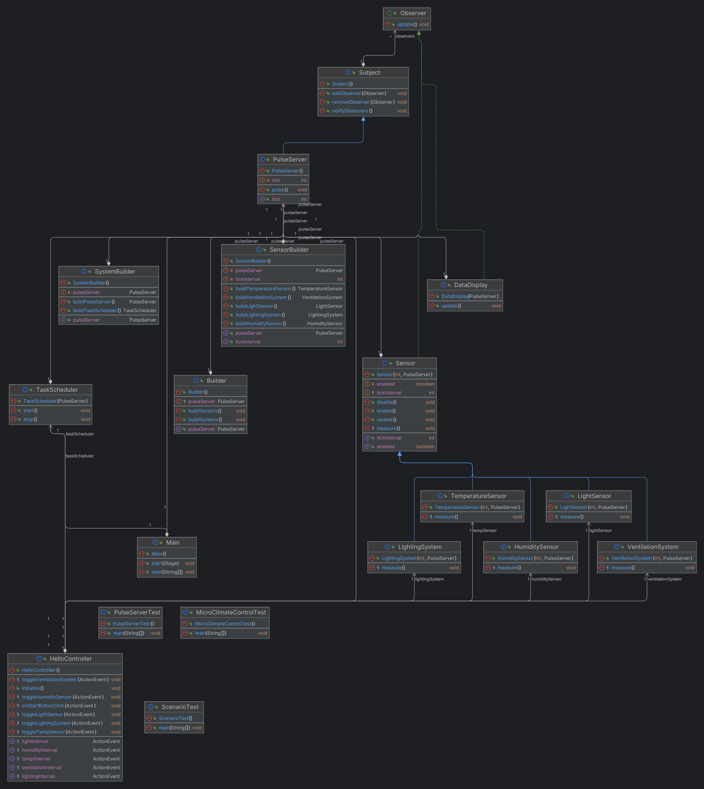

# Технология программирования
Технология программирования - технология разработки программного средства, включающая все процессы, начиная с момента зарождения идеи этого средства. Результатом применения технологий программирования является программа, действующая в заданной вычислительной среде, хорошо отлаженная и документированная, доступная для понимания и развития в процессе сопровождения.

> [!IMPORTANT]
> Лабораторные работы по дисциплине __"Технология программирования"__
> > бОИС-221 Сенцов Д.С.
- [x] Самостоятельная работа
- ["Сколько до пары" (Task 1)](https://github.com/gedjien/bois221_javafx_sn/tree/prTask_NowLesson)
- ["Погоня за фигурами" (Task 2)](https://github.com/gedjien/bois221_javafx_sn/tree/prTask_%D0%A1hase-for-figures)
- ["Таймер времени" (Task 3)](https://github.com/gedjien/bois221_javafx_sn/tree/prTask_TimerServer)

# "Таймер времени"

Программа предназначена для управления  микроклиматом, используя сигналы с сервера тактовых импульсов (Pulse Server).

## Сценарий использования

Имеется сервер тактовых импульсов (Pulse Server), с которого компоненты системы управления микроклиматом получают сигналы для корректировки своего времени.

иимтируются такты синхронизации, т.е. сигнал через фиксированный промежуток времени
 
Датчики температуры и влажности: 
         Измеряет температуру через заданное число тиков и отправляет уведомления о результатах измерений.

Датчик освещенности: 
         Включает свет, распылители и прочее оборудование через заданный интервал тиков, например, включаясь и выключаясь в определенное время суток
          
Система вентиляции:
         Регулирует скорость вентиляции в соответствии с заданным графиком и полученными данными от датчиков.

Система освещения:
          Регулирует интенсивность и время работы освещения в соответствии с заданным графиком и полученными данными от датчиков.

## Архитектура приложения

Паттерн "Наблюдатель" для связи компонетов и сервера

## Реализация

PulseServer центральный компонент, который генерирует тики через равные промежутки времени, расширяет класс Subject и реализует паттерн Observer для уведомления всех подписанных объектов о новом тике

Sensor абстрактный класс, который представляет собой базовый класс для всех датчиков и систем. Он реализует интерфейс Observer и подписывается на PulseServer для получения уведомлений о тиках, каждый датчик или система выполняет свои измерения или действия только на определенных тиках, которые задаются через tickInterval
Датчики и системы: TemperatureSensor, HumiditySensor, LightSensor, VentilationSystem, LightingSystem

TaskScheduler отвечает за запуск PulseServer и генерацию тиков через равные промежутки времени

SensorBuilder класс-строитель, который используется для создания датчиков и систем с заданными параметрами, реализует паттерн Builder, что позволяет гибко настраивать объекты датчиков и систем

SystemBuilder используется для создания компонентов системы, таких как PulseServer и TaskScheduler, реализует паттерн Builder

DataDisplay отображает текущий тик PulseServer в графическом интерфейсе, реализует интерфейс Observer и обновляет интерфейс при каждом новом тике

Main точка входа в приложение

Пример работы системы:
1. Пользователь запускает приложение и нажимает кнопку "Старт" для запуска TaskScheduler.
2. PulseServer начинает генерировать тики, и датчики начинают измерять параметры окружающей среды на заданных интервалах.
3. Пользователь может включать/выключать датчики и системы, а также изменять интервалы их работы через графический интерфейс.
4. В реальном времени отображается текущий тик PulseServer, что позволяет пользователю видеть, как система работает.

Паттерны Наблюдатель, Строитель

## Диаграмма классов

