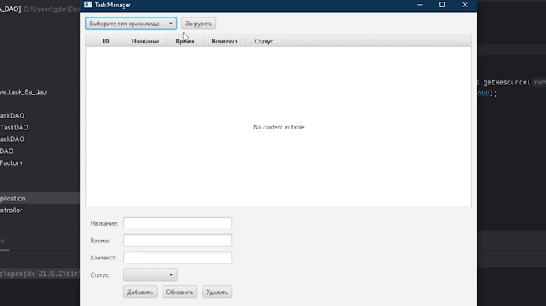

# Технология программирования
Технология программирования - технология разработки программного средства, включающая все процессы, начиная с момента зарождения идеи этого средства. Результатом применения технологий программирования является программа, действующая в заданной вычислительной среде, хорошо отлаженная и документированная, доступная для понимания и развития в процессе сопровождения.

> [!IMPORTANT]
> Лабораторные работы по дисциплине __"Технология программирования"__
> > бОИС-221 Сенцов Д.С.
- [x] Лабораторные работы
- ["DAO" (Task 8A)](https://github.com/gedjien/bois221_javafx_sn/tree/Task_8A_DAO)
- ["Цепочка обязанностей" (Task 14)](https://github.com/gedjien/bois221_javafx_sn/tree/Task14_ChainOfResponsibilities)
- ["Command" (Task 16)](https://github.com/gedjien/bois221_javafx_sn/tree/Task_16_Bot)

# "Цепочка обязанностей"

Паттерн Цепочка обязанностей позволяет избежать привязки отправителя запроса к его получателю, давая шанс обработать запрос нескольким  связанным объектам, передавая запрос вдоль этой цепочки, пока его не обработают.

## Функуиональные требования

**Требуется создать  игровой автомат со следующим геймплеем:**
 
Пользователю предлагается три мешочка (один из которых якобы выигрышный), пользователь выбирает мешочек 

либо в нем нет монеток - он проиграл, тогда он может снова кинуть монетку для продолжения игры, 

либо  в нем есть монетки -  пользователь может забрать выигрыш и закончить игру или  может снова играть на выигранное.

Конечно, никто не планирует эти мешочки заполнять случайным образом, и определение удача/неудача  никак не зависит от выбранной картинки на экране. Поэтому обработка одинакова для всех кнопок, а вот стратегия по отношению к пользователю может быть различна - "удержать", "обобрать", "дать надежду" и может зависеть от продолжительности игры, активности пользователя и т.п.

## Диаграмма классов

