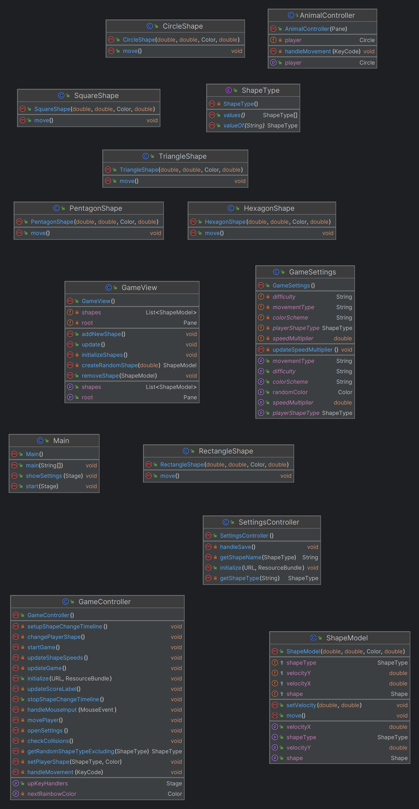

# Технология программирования
Технология программирования - технология разработки программного средства, включающая все процессы, начиная с момента зарождения идеи этого средства. Результатом применения технологий программирования является программа, действующая в заданной вычислительной среде, хорошо отлаженная и документированная, доступная для понимания и развития в процессе сопровождения.

> [!IMPORTANT]
> Лабораторные работы по дисциплине __"Технология программирования"__
> > бОИС-221 Сенцов Д.С.
- [x] Самостоятельная работа
- ["Сколько до пары" (Task 1)](https://github.com/gedjien/bois221_javafx_sn/tree/prTask_NowLesson)
- ["Погоня за фигурами" (Task 2)](https://github.com/gedjien/bois221_javafx_sn/tree/prTask_%D0%A1hase-for-figures)
- ["Таймер времени" (Task 3)](https://github.com/gedjien/bois221_javafx_sn/tree/prTask_TimerServer)

# "Погоня за фигурами"

Программа предназначена для обучения детей (возраст 3-6 лет) различать геометрические фигуры (круг, квадрат, треугольник, прямоугольник) в игровой форме.

## Сценарий использования

 На фоне изображения (например, поля, леса) отображаются фигуры (круг, квадрат, треугольник, прямоугольник).
 
 Фигуры движутся по экрану (по заданному сценарию или случайно). и могут отличаться по размеру, цвету и расположению.  
 
 Игрок управляет персонажем (например, машинкой, зверушкой) с помощью кнопок или сенсорного экрана.
 
 Задача игрока: догнать заданную фигуру и "поймать" ее, нажав на соответствующую кнопку или на экране.
 
 После успешного "поимки" фигуры, игрок получает балл и появляется новая фигура для поимки.
 
 По мере прохождения игры, скорость движения фигур увеличивается, добавляются новые фигуры (например, пятиугольник, шестиугольник).

 Предусмотреть возможность различных настроек:
 
     Выбор уровня сложности (количество фигур, скорость движения).
     Выбор цветовой гаммы игры.

## Реализация

Main точка входа в приложение

GameView отвечает за отображение игрового поля и управление фигурами, создает и управляет фигурами, которые появляются на экране

ShapeModel абстрактный класс, который представляет базовую модель фигуры, содержит общие свойства и методы для всех фигур, такие как координаты, скорость, цвет и размер.
Каждая конкретная фигура (CircleShape, SquareShape, TriangleShape, RectangleShape, PentagonShape, HexagonShape) наследует этот класс и реализует метод move, который определяет, как фигура движется по экрану

GameController контроллер для игрового интерфейса, управляет логикой игры, включая обработку ввода пользователя, обновление игрового состояния и проверку столкновений

GameSettings класс хранит настройки игры, такие как сложность, цветовая схема, тип перемещения и форма игрока

SettingsController контроллер для окна настроек, управляет взаимодействием пользователя с настройками игры, такими как выбор сложности, цветовой схемы, типа перемещения и формы игрока

AnimalController класс управляет движением игрока, обрабатывает нажатия клавиш и перемещает фигуру игрока в зависимости от выбранного типа перемещения (телепортация или плавное перемещение).

Пример работы игры:
1. Пользователь запускает игру и видит игровое поле с несколькими фигурами.
2. Игрок управляет своей фигурой с помощью мыши или клавиш, стараясь "поймать" фигуры того же типа.
3. Каждые 5 секунд форма и цвет фигуры игрока меняются, что усложняет задачу.
4. Пользователь может открыть окно настроек и изменить сложность, цветовую схему, тип перемещения и форму игрока.
5. Игра продолжается до тех пор, пока пользователь не закроет окно.

Паттерны:
Momento, Observer, Factory Method, Prototype, Decorator

## Диаграмма классов

